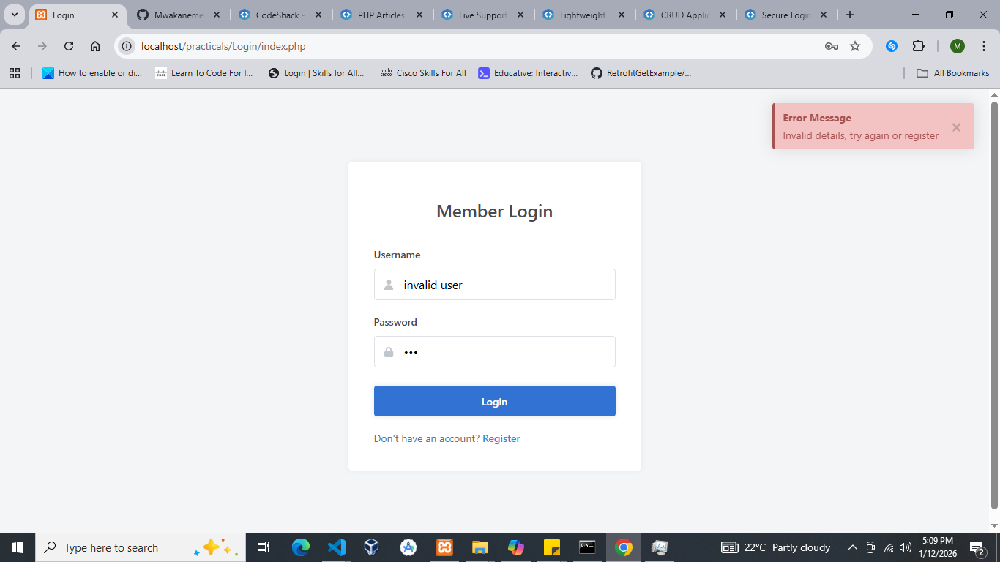
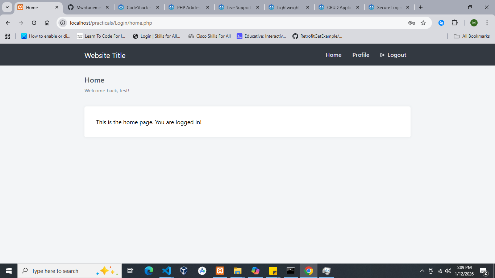

# Secure Login System

A project about how login system works in PHP with the help of ajax

## 🚀 Features(What I learned from this project)
- Form Design
- Prepared SQL Queries
- Basic Validation
- Session Management
- Ajax
- Ability to utilize my own made javascript toast library

## 📷 Screenshots

Here’s how you include images:


*Screenshot of the login page form design.*



*Screenshot of the login page incase of error.*



*Screenshot of the login page incase of success.*

## ⚙️ Installation
```bash
git clone https://github.com/Mwakanemela/PHP-Login.git
cd repo
